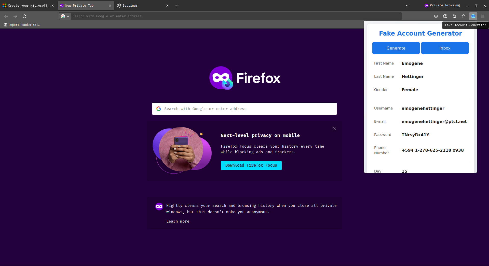
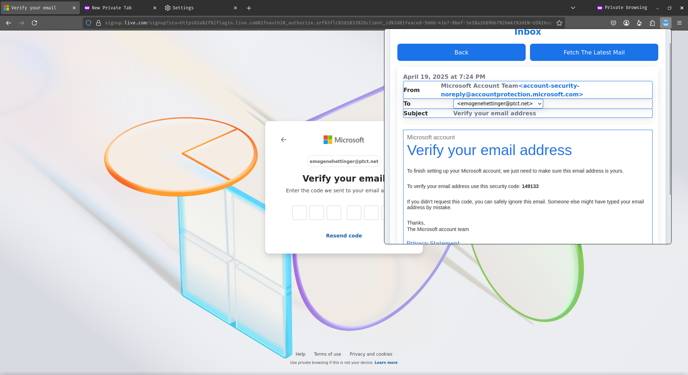

# Fake Account Generator

Generate temporary accounts with fully usable email addresses – instantly and privately.

  
  

---

## 🧩 Description

**Fake Account Generator** is a lightweight and privacy-focused Firefox extension that allows users to create fake yet usable online identities in seconds.

Whether you want to access a website without giving away your personal information, sign up for a free trial, or test something anonymously — this add-on makes it effortless. With just a single click, it generates a random fake profile including a **temporary, working email address**. You can even view and download emails and attachments received by the generated email — all without ever leaving your browser or giving away real data.

This is the ideal tool for anyone who wants to reduce spam, protect their identity, or simply avoid the hassle of using their real email address.

---

## ✨ Features

- **🔘 One-Click Account Generator**  
  Instantly generate a full fake profile and usable temporary email address.

- **📥 Real-Time Email Inbox**  
  View the most recent message received on your generated email with a single click.

- **📎 Attachment Support**  
  Download attachments and inline images directly from the inbox view.

- **📋 Clipboard Copy**  
  Tap any field (like name, email, or password) to instantly copy it to your clipboard.

- **🧑‍💻 Simple, Minimal Interface**  
  A clean and easy-to-navigate UI that lets you focus on the essentials — no clutter.

---

## 🚀 How to Use

1. **Click the Icon**  
   Click the **Fake Account Generator** icon in your Firefox toolbar.

2. **Generate an Account**  
   Press **Generate** to create a complete random identity and temporary email.

3. **Copy Any Field**  
   Click on any displayed information (like username, password, or email) to copy it.

4. **Fetch Messages**  
   Click **Refresh** to fetch and view the most recent message sent to your generated email.

5. **Download Files**  
   Any attachments or inline images can be saved from the **Attachments** section on the inbox page.

> 💡 **Tip**: Generate an email first before trying to fetch messages. A working internet connection is needed to retrieve mail.

---

## 🖼️ Screenshots

  
*Easily generate fake accounts and view key details.*

  
*See messages, attachments, and sender details at a glance.*

---

## 🔐 Permissions

This add-on requests the following permissions:

- **Storage** – To save generated accounts locally for your session.
- **Clipboard** – To copy generated content like email or password directly to your clipboard.

---
> ✅ **No personal data is ever collected. All data stays on your device.**
---

## 🧪 Compatibility

- Works with **Firefox** and Firefox-based browsers like **LibreWolf**  
- Tested on:
  - **Firefox Nightly v139.0a1**
  - **LibreWolf v137.0.2-1**

---

This is a passion project built for people who care about privacy ✨
